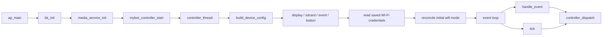
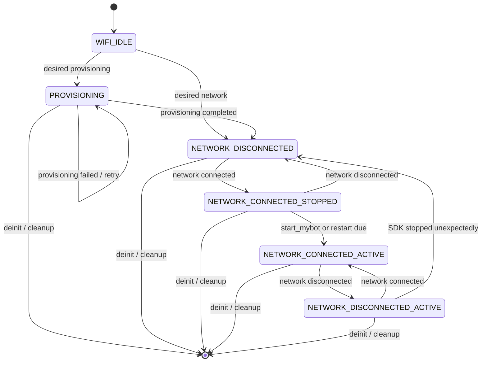

# mybot Component

`mybot` 是 BK7258 方案中承上启下的共享组件：对上被 `projects/mybot` 以薄入口启动，对下通过 `platforms/bk725x` 适配 BK SDK、Wi-Fi、音频、显示、存储和 SWD/配网能力。

## 目录与职责

### Project 层

| 路径 | 职责 |
| --- | --- |
| `projects/mybot/ap` | AP 启动入口：`bk_init()`、`media_service_init()`、`mybot_controller_start()` |
| `projects/mybot/cp` | CP 启动入口与 SMP boot 控制 |
| `projects/mybot/partitions` | BK7258 分区表 |
| `projects/mybot/ap/config` | AP 板级 Kconfig / GPIO 配置 |

### Component 层

| 路径 | 职责 |
| --- | --- |
| `include/mybot` | 对外公开 API，只暴露平台无关的 SDK 接口 |
| `src/core` | 应用生命周期、设备生命周期、协议状态、版本 |
| `src/service` | 云端设备客户端与请求协程 |
| `src/support` | HTTP client、JSON、ring buffer 等基础支撑 |
| `src/media` | SDK 内部音频抽象与 wake word 抽象 |
| `src/rtc` | Agora RTC 会话管理 |
| `platforms/bk725x/adapter` | 将 BK 平台能力注入 SDK ops 接口 |
| `platforms/bk725x/modules/controller` | AP 应用控制器，事件循环与生命周期编排 |
| `platforms/bk725x/modules/audio` | 采集、共享播放、音量、ogg 解码、prompt player |
| `platforms/bk725x/modules/network` | 配网 portal、Wi-Fi 凭据、connectivity |
| `platforms/bk725x/modules/display` | 双屏显示与帧渲染 |
| `platforms/bk725x/modules/button`、`event`、`key` | 按键输入、事件队列、按键分发 |
| `platforms/bk725x/modules/storage` | KV、SD 卡与 USB MSC |

## AP 启动流程



关键实现：

- `bk_solution_ai/projects/mybot/ap/ap_main.c`
- `components/mybot/platforms/bk725x/modules/controller/mybot_controller_bk725x.c`

## Controller 三层状态机

### State 层

状态由 `controller_sync_state()` 根据当前 `wifi_mode`、`network_connected` 和 `mybot_active` 派生，不单独赋语义 FSM 状态，避免两套状态源不一致。

| 状态 | 含义 |
| --- | --- |
| `CONTROLLER_STATE_WIFI_IDLE` | Wi-Fi 模式切换的中间态 |
| `CONTROLLER_STATE_PROVISIONING` | APSTA 配网模式 |
| `CONTROLLER_STATE_NETWORK_DISCONNECTED` | 普通 STA 模式，网络未连接 |
| `CONTROLLER_STATE_NETWORK_CONNECTED_STOPPED` | 已连接但 mybot SDK 未运行 |
| `CONTROLLER_STATE_NETWORK_CONNECTED_ACTIVE` | 已连接且 SDK 运行中 |
| `CONTROLLER_STATE_NETWORK_DISCONNECTED_ACTIVE` | SDK 运行中但网络已断开 |

### Event 层

外部事件由 `controller_event_from_mybot()` 从 `MYBOT_EVENT_*` 映射为 controller 内部事件；`controller_tick()` 再产生定时 poll 事件。

| 类型 | 事件 |
| --- | --- |
| 外部按键 | volume up / down / conversation toggle / provisioning request |
| 外部网络 | network connected / disconnected / failed |
| 外部配网 | provisioning completed / failed |
| 定时轮询 | network state、provisioning state、wifi reconcile、mybot running、mybot restart |

### Transition 层

所有状态转移集中在 `s_transitions[]`，每行声明：

- `event`：触发事件
- `from_states`：合法源状态掩码
- `guard`：可选前置条件，例如 `event_is_from_current_wifi()`
- `handler`：执行具体副作用

分发入口为 `controller_dispatch()`。`handle_event()` 只负责翻译外部事件，`tick()` 只按顺序派发 5 个 poll 事件：

1. `POLL_NETWORK_STATE`
2. `POLL_PROVISIONING_STATE`
3. `POLL_WIFI_RECONCILE`
4. `POLL_MYBOT_RUNNING`
5. `POLL_MYBOT_RESTART`

### 生命周期示意



该图为简化示意，最终判定以 `s_transitions[]` 和 `controller_sync_state()` 为准。

## 新增/修改 controller 事件时

- 先在 `controller_state_t` 中确认是否需要新增状态。
- 在 `controller_event_kind_t` 中增加事件，并补 `controller_event_from_mybot()` 映射（外部事件才有此步骤）。
- 在 `s_transitions[]` 增加一行；状态范围使用状态掩码宏。
- guard 只做纯判断，side effects 放在 handler。
- 不要直接给 `app_runtime_t.state` 赋值，状态只能由 `controller_sync_state()` 派生。

## 语音提示资源（assets）

提示语音存放在 `projects/mybot/assets`（按 `locales/<lang>` 组织），音频为
Opus-in-Ogg（16 kHz 单声道、24 kbps VBR）。资源以 C 数组嵌入 AP 固件，播放器
直接从固件中的只读数组读取 OGG 数据并解码，不依赖 SD 卡上的资源文件。

修改或新增语音后，先转换并重新生成数组，再编译固件：

1. **转换**：`projects/mybot/scripts/convert_pcm_to_ogg.sh` 把 16 kHz mono s16le
   PCM 转成 `.ogg`。编码参数固定，解码器 `mybot_ogg_pcm_bk725x.c` 依赖该参数，
   不要手工指定其它编码方式。
2. **生成数组**：

   ```bash
   python3 projects/mybot/scripts/generate_assets_c.py \
     projects/mybot/assets \
     components/mybot/platforms/bk725x/modules/storage/mybot_assets.c
   ```

   生成器只收集 `assets/locales/**/*.ogg`，许可证和说明文件不会进入数组。
3. **编译**：执行 `make bk7258`，`mybot_assets.c` 会作为 `mybot` 组件源文件编译进 AP 固件。

现有文件与播放路径的对应关系：

- `wificonfig.ogg` / `success.ogg` → `modules/audio/mybot_prompt_player_bk725x.c`
  （`mybot_prompt_player_bk725x_play_provisioning()` / `_play_success()`）。
- `prompt.ogg`、`0.ogg`~`9.ogg`（配对码播报）→
  `modules/announce/mybot_announce_pcm_bk725x.c` 的 `sound_file_name()`，通过
  `mybot_announce_sound_t` 枚举调用。

新增语音除了放文件并重新生成数组，还需在上述模块里加对应的播放路径/枚举才会被
引用。数组保存压缩后的 OGG 字节，会占用 AP 固件的 Flash 空间；解码后的 PCM
缓冲区仍在运行时分配到 PSRAM。新增大量音频时请检查 AP 固件的 Flash 使用率。

## 资源归属约定

- 平台无关 core 使用 `aosl_hal_malloc` 系列。
- BK725x 平台模块和 PSRAM 数据使用 `psram_malloc` / `psram_zalloc` / `psram_free`。
- 共享播放管线的 start/stop 和 audio power vote 统一由 audio 模块负责，controller 只编排调用顺序。
